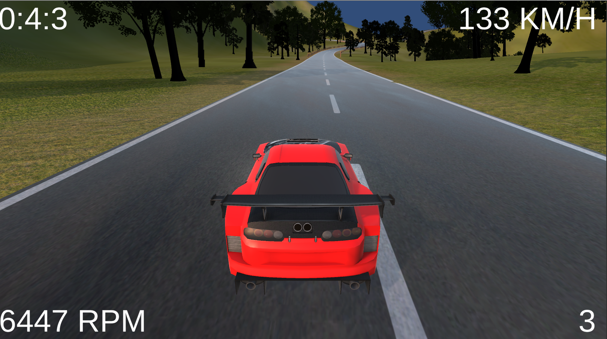

# Unity_3D_Racing_Game
There are multiple camera views for each car, and multiple selection menus.
The game has three tracks that you can drive on with an option of picking one of two cars. 

## Picture 


## Getting Started
These instructions will get you a copy of the project up and running on your local machine.


### Prerequisites
You will need unity version 2019.2.12f1

### Installing
Download the source code.
```
git clone https://github.com/AbdelhalemKassara/Unity_3D_Racing_Game.git
```
In unity go to file open project then select the folder called 3d Racing Game.

Next go to file, click on build and run. Unity will start compiling the game.

When unity has finished compiling the game will start running.


C# 

Unity 2019.2.12f1
